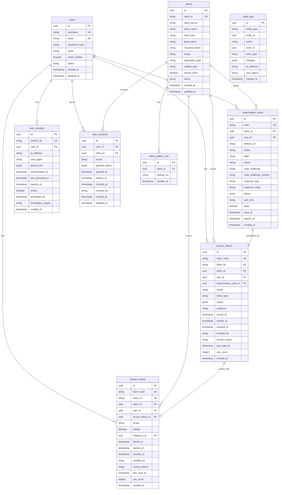

# データベース設計書

## 1. 概要

### 1.1 目的
OpenID Connect仕様に準拠した認証プロバイダー(OP)のデモ実装

### 1.2 スコープ
- OpenID Connect Core 1.0の基本機能のデモ
- Authorization Code Flow
- JWT形式のIDトークン発行
- Discovery機能
- 最小限のユーザー・クライアント管理

### 1.3 データベース選定
- **PostgreSQL 17.6**: メインデータベース（最新安定版）
- **Redis 8.0**: セッションストア、キャッシュ（最新安定版、大幅な性能向上）

### 1.4 設計方針
- OIDC Core 1.0仕様準拠を最優先
- デモに必要な最小限のテーブル構成
- UUID v4を主キーに使用
- タイムスタンプは全てUTC
- セキュアなデフォルト設定（PKCE必須、pairwise subject等）

## 2. ER図



## 3. テーブル定義

### 3.1 users（ユーザー）

#### テーブル説明
`users`テーブルは、システムに登録されたエンドユーザーの情報を管理します。OpenID Connect仕様で定義された標準クレーム（Standard Claims）に対応したカラム構成となっており、ユーザープロファイル、認証情報、アカウントステータスを一元管理します。このテーブルは、認証フローの中核となるエンティティであり、発行されるIDトークンやUserInfoエンドポイントの応答データの基になります。

**主な役割:**
- ユーザー認証情報の保存（ユーザー名、パスワードハッシュ）
- OpenID Connect標準クレームの管理
- アカウントセキュリティ管理（ロック、失敗試行回数）
- ユーザープロファイル情報の提供

| カラム名 | データ型 | NULL | デフォルト | 説明 | 設計意図・必要性 |
|---------|---------|------|-----------|------|--------------|
| id | UUID | NO | uuid_generate_v4() | 主キー | 分散環境でも衝突しないグローバルユニークIDを保証。マイクロサービス化や複数DB環境への移行も考慮 |
| username | VARCHAR(50) | NO | - | ユーザー名（一意） | ログイン時の識別子。メールアドレスを公開したくないユーザーのため、emailとは別に用意 |
| email | VARCHAR(255) | NO | - | メールアドレス（一意） | 主要な連絡手段、パスワードリセット、OIDC標準クレーム(email claim)として必須 |
| password_hash | VARCHAR(255) | NO | - | パスワードハッシュ | 認証情報。平文保存は絶対NGのため、bcrypt等でハッシュ化して保存 |
| name | VARCHAR(255) | YES | NULL | フルネーム | OIDC標準クレーム。IDトークンに含める表示名として使用 |
| email_verified | BOOLEAN | NO | false | メール検証済み | OIDC標準クレーム。メールアドレスの所有権確認、なりすまし防止 |
| status | VARCHAR(20) | NO | 'active' | ステータス | アカウントの状態管理（active/suspended/locked等）、不正利用対策 |
| created_at | TIMESTAMP | NO | CURRENT_TIMESTAMP | 作成日時 | 監査証跡、アカウント年齢の把握 |
| updated_at | TIMESTAMP | NO | CURRENT_TIMESTAMP | 更新日時 | 変更追跡、データ同期の基準時刻 |

#### インデックス
- `idx_users_username` (username)
- `idx_users_email` (email)
- `idx_users_status` (status)
- `idx_users_deleted_at` (deleted_at)

### 3.2 clients（クライアント）

#### テーブル説明
`clients`テーブルは、OAuth 2.0/OpenID Connectクライアントアプリケーションの登録情報を管理します。このテーブルには、クライアントの認証方法、許可されたグラントタイプ、リダイレクトURI、セキュリティ設定など、クライアントアプリケーションがOIDC OPと通信するために必要な全ての設定情報が含まれます。Dynamic Client Registration仕様にも対応可能な構造となっています。

**主な役割:**
- クライアント認証情報の管理（client_id, client_secret）
- 許可されたOAuth/OIDCフローの定義
- セキュリティポリシーの設定（PKCE必須、トークン署名アルゴリズム等）
- クライアントメタデータの保存

| カラム名 | データ型 | NULL | デフォルト | 説明 | 設計意図・必要性 |
|---------|---------|------|-----------|------|---------------|
| id | UUID | NO | uuid_generate_v4() | 主キー | 内部管理用ID。client_idとは別に内部参照用のIDが必要 |
| client_id | VARCHAR(255) | NO | - | クライアントID（一意） | OAuth仕様の識別子。外部に公開される一意のクライアント識別子 |
| client_secret | VARCHAR(255) | YES | NULL | クライアントシークレット | confidentialクライアントの認証情報。publicクライアント（SPA等）はNULL |
| client_name | VARCHAR(255) | NO | - | クライアント名 | ユーザーへの表示用。同意画面で「○○アプリがアクセスを要求しています」等で使用 |
| client_type | VARCHAR(20) | NO | 'confidential' | クライアントタイプ | confidential（サーバーサイド）/public（SPA、モバイル）の区別。セキュリティ要件が異なる |
| grant_types | TEXT | NO | 'authorization_code' | 許可するグラントタイプ（カンマ区切り） | 使用可能なOAuthフローの制限。セキュリティポリシーに応じて制御 |
| response_types | TEXT | NO | 'code' | 許可するレスポンスタイプ（カンマ区切り） | code/token/id_token等。Implicit Flowを禁止する等のセキュリティ制御 |
| scope | TEXT | YES | NULL | デフォルトスコープ | クライアントが要求できる最大権限の定義。最小権限の原則 |
| application_type | VARCHAR(20) | NO | 'web' | アプリケーションタイプ | web/nativeの区別。リダイレクトURIの検証ルールが異なる |
| subject_type | VARCHAR(20) | NO | 'pairwise' | サブジェクトタイプ | プライバシー保護のためpairwise（クライアントごとに異なるsub）をデフォルトとする |
| require_pkce | BOOLEAN | NO | true | PKCE必須 | セキュリティ強化のため、全クライアントでPKCEをデフォルト必須とする |
| status | VARCHAR(20) | NO | 'active' | ステータス | クライアントの有効/無効管理。不正利用時の即座の無効化 |
| created_at | TIMESTAMP | NO | CURRENT_TIMESTAMP | 作成日時 | 監査証跡、クライアント登録時期の把握 |
| updated_at | TIMESTAMP | NO | CURRENT_TIMESTAMP | 更新日時 | 変更追跡、設定変更の監視 |

#### インデックス
- `idx_clients_client_id` (client_id)
- `idx_clients_status` (status)
- `idx_clients_deleted_at` (deleted_at)

### 3.3 client_redirect_uris（リダイレクトURI）

#### テーブル説明
`client_redirect_uris`テーブルは、各クライアントに対して許可されたリダイレクトURIのリストを管理します。セキュリティ上の理由から、リダイレクトURIは事前に登録されたもののみを許可する必要があり、このテーブルで厳密に管理されます。OAuth 2.0のオープンリダイレクト攻撃を防ぐための重要なセキュリティ機構です。

**主な役割:**
- 許可されたリダイレクトURIの管理
- オープンリダイレクト攻撃の防止
- クライアントごとの複数リダイレクトURI対応

| カラム名 | データ型 | NULL | デフォルト | 説明 | 設計意図・必要性 |
|---------|---------|------|-----------|------|---------------|
| id | UUID | NO | uuid_generate_v4() | 主キー | 内部管理用ID |
| client_id | UUID | NO | - | クライアントID（外部キー） | どのクライアントに紐づくURIかを管理 |
| redirect_uri | VARCHAR(500) | NO | - | リダイレクトURI | オープンリダイレクト攻撃防止のため、完全一致で検証。ワイルドカードは使用禁止 |
| created_at | TIMESTAMP | NO | CURRENT_TIMESTAMP | 作成日時 | 監査用。いつ登録されたURIかを追跡 |

#### インデックス
- `idx_redirect_uris_client_id` (client_id)
- `idx_redirect_uris_uri` (redirect_uri)

### 3.4 authorization_codes（認可コード）

#### テーブル説明
`authorization_codes`テーブルは、Authorization Code Flowで発行される一時的な認可コードを管理します。認可コードは短期間（通常10分）のみ有効で、一度使用されると無効化されます。PKCEパラメータやnonceなど、セキュリティ強化のための情報も保存され、トークンエンドポイントでの検証に使用されます。

**主な役割:**
- 認可コードの発行と管理
- PKCEチャレンジの保存と検証
- 認可時のパラメータ（scope, nonce等）の保持
- 使用済みコードの追跡と二重使用防止

| カラム名 | データ型 | NULL | デフォルト | 説明 | 設計意図・必要性 |
|---------|---------|------|-----------|------|---------------|
| id | UUID | NO | uuid_generate_v4() | 主キー | 内部管理用ID |
| code | VARCHAR(255) | NO | - | 認可コード（一意） | ユーザーがトークンと交換する一時的なコード。推測不可なランダム文字列 |
| client_id | UUID | NO | - | クライアントID（外部キー） | コードを発行したクライアント。トークン交換時に検証 |
| user_id | UUID | NO | - | ユーザーID（外部キー） | 認可したユーザー。トークンに含めるsubクレームの基 |
| redirect_uri | VARCHAR(500) | NO | - | リダイレクトURI | トークン交換時に同一URIか検証。セキュリティのため必須 |
| scope | TEXT | NO | - | スコープ | ユーザーが同意した権限範囲。トークンにそのまま引き継がれる |
| state | VARCHAR(255) | YES | NULL | stateパラメータ | CSRF攻撃防止用。クライアントが検証するため保存のみ |
| nonce | VARCHAR(255) | YES | NULL | nonce値 | IDトークンのリプレイ攻撃防止。IDトークンに含めてクライアントが検証 |
| code_challenge | VARCHAR(255) | YES | NULL | PKCEチャレンジ | publicクライアントのセキュリティ強化。code_verifierのハッシュ値 |
| code_challenge_method | VARCHAR(10) | YES | NULL | PKCEメソッド | S256（SHA256）またはplain。ハッシュ方式の指定 |
| response_type | VARCHAR(50) | NO | - | レスポンスタイプ | code/token/id_token等。フローの種類を記録 |
| response_mode | VARCHAR(50) | YES | NULL | レスポンスモード | query/fragment/form_post等。応答の返し方を指定 |
| claims | JSONB | YES | NULL | 要求クレーム | クライアントが要求した特定のクレーム。IDトークン/UserInfoに含める |
| auth_time | TIMESTAMP | NO | - | 認証時刻 | ユーザーが実際に認証した時刻。max_age検証やauth_timeクレーム用 |
| used | BOOLEAN | NO | false | 使用済みフラグ | 二重使用防止。一度使用されたコードは無効 |
| used_at | TIMESTAMP | YES | NULL | 使用日時 | いつトークンと交換されたか。監査・不正検知用 |
| expires_at | TIMESTAMP | NO | - | 有効期限 | 通常10分。短時間で失効しセキュリティリスクを減らす |
| created_at | TIMESTAMP | NO | CURRENT_TIMESTAMP | 作成日時 | 監査証跡、有効期限計算の基準 |

#### インデックス
- `idx_auth_codes_code` (code)
- `idx_auth_codes_client_user` (client_id, user_id)
- `idx_auth_codes_expires_at` (expires_at)
- `idx_auth_codes_used` (used)

### 3.5 access_tokens（アクセストークン）

#### テーブル説明
`access_tokens`テーブルは、発行されたアクセストークンの情報を管理します。実際のトークン値はハッシュ化して保存し、セキュリティを確保します。トークンの使用状況、失効管理、監査ログとして、いつ・誰が・どのように使用したかを追跡可能な構造となっています。

**主な役割:**
- アクセストークンのライフサイクル管理
- トークン失効（revocation）の処理
- 使用統計の記録（最終使用日時、使用回数）
- トークン検証のための情報保持

| カラム名 | データ型 | NULL | デフォルト | 説明 | 設計意図・必要性 |
|---------|---------|------|-----------|------|---------------|
| id | UUID | NO | uuid_generate_v4() | 主キー | 内部管理用ID |
| token_hash | VARCHAR(255) | NO | - | トークンハッシュ（一意） | トークン値を直接保存すると漏洩リスクが高いためSHA256でハッシュ化 |
| token_id | VARCHAR(255) | NO | - | JWT ID (jti)（一意） | JWTの一意識別子。トークンの重複発行防止、失効リスト管理用 |
| client_id | UUID | NO | - | クライアントID（外部キー） | トークンを発行したクライアント。アクセス制御と監査用 |
| user_id | UUID | NO | - | ユーザーID（外部キー） | トークンの所有者。ユーザー別のトークン管理、一括失効用 |
| authorization_code_id | UUID | YES | NULL | 認可コードID（外部キー） | トークンの発行元を追跡。不正トークンの調査用 |
| scope | TEXT | NO | - | スコープ | トークンが持つ権限範囲。アクセス制御の基本 |
| token_type | VARCHAR(20) | NO | 'Bearer' | トークンタイプ | OAuth2仕様。通常Bearerだが将来の拡張に備える |
| claims | JSONB | YES | NULL | 追加クレーム | 標準以外のカスタム情報。柔軟な拡張が可能 |
| audience | TEXT | YES | NULL | オーディエンス | トークンの利用先制限。特定のAPIのみで有効なトークンの実現 |
| issued_at | TIMESTAMP | NO | - | 発行日時 | トークンの年齢計算、監査証跡 |
| expires_at | TIMESTAMP | NO | - | 有効期限 | 通常1時間。短い有効期限でセキュリティリスクを最小化 |
| revoked_at | TIMESTAMP | YES | NULL | 失効日時 | 明示的な失効時刻。ログアウトや異常検知時に設定 |
| revoked_by | VARCHAR(255) | YES | NULL | 失効実行者 | 誰が失効させたか（ユーザー/管理者/システム）。監査用 |
| revoke_reason | TEXT | YES | NULL | 失効理由 | なぜ失効させたか。セキュリティインシデントの分析用 |
| last_used_at | TIMESTAMP | YES | NULL | 最終使用日時 | トークンの活性度確認、休眠トークンの検出 |
| use_count | INTEGER | NO | 0 | 使用回数 | 使用頻度の分析、異常な使用パターンの検出 |
| created_at | TIMESTAMP | NO | CURRENT_TIMESTAMP | 作成日時 | 監査証跡、トークンライフサイクルの追跡 |

#### インデックス
- `idx_access_tokens_token_hash` (token_hash)
- `idx_access_tokens_token_id` (token_id)
- `idx_access_tokens_client_user` (client_id, user_id)
- `idx_access_tokens_expires_at` (expires_at)
- `idx_access_tokens_revoked_at` (revoked_at)

### 3.6 refresh_tokens（リフレッシュトークン）

#### テーブル説明
`refresh_tokens`テーブルは、長期間有効なリフレッシュトークンを管理します。リフレッシュトークンローテーション機能に対応し、使用されたトークンは新しいトークンにローテーションされます。これにより、トークンの不正使用を検知し、セキュリティを向上させます。

**主な役割:**
- リフレッシュトークンの発行と管理
- トークンローテーションの追跡
- 長期的なセッション維持
- 不正使用の検知と対処

| カラム名 | データ型 | NULL | デフォルト | 説明 | 設計意図・必要性 |
|---------|---------|------|-----------|------|---------------|
| id | UUID | NO | uuid_generate_v4() | 主キー | 内部管理用ID |
| token_hash | VARCHAR(255) | NO | - | トークンハッシュ（一意） | トークン値をハッシュ化して保存。DB漏洩時のリスク軽減 |
| token_id | VARCHAR(255) | NO | - | JWT ID (jti)（一意） | リフレッシュトークンの一意識別子。ローテーション追跡用 |
| client_id | UUID | NO | - | クライアントID（外部キー） | トークン発行先クライアント。クライアント別の失効処理用 |
| user_id | UUID | NO | - | ユーザーID（外部キー） | トークン所有者。ユーザー別のトークン管理 |
| access_token_id | UUID | YES | NULL | アクセストークンID（外部キー） | ペアとなるアクセストークン。一緒に失効させるため |
| scope | TEXT | NO | - | スコープ | 更新可能な権限範囲。初回認可時のスコープを維持 |
| rotated | BOOLEAN | NO | false | ローテーション済みフラグ | 使用済みトークンの識別。ローテーション後は無効 |
| rotated_to_id | UUID | YES | NULL | ローテーション先ID（外部キー） | 新しいトークンへの参照。ローテーションチェーンの追跡 |
| issued_at | TIMESTAMP | NO | - | 発行日時 | トークン年齢の計算、監査証跡 |
| expires_at | TIMESTAMP | NO | - | 有効期限 | 通常30日。長期セッションとセキュリティのバランス |
| revoked_at | TIMESTAMP | YES | NULL | 失効日時 | 明示的失効時刻。不正使用検知時に即座失効 |
| revoked_by | VARCHAR(255) | YES | NULL | 失効実行者 | 失効操作の実行者追跡 |
| revoke_reason | TEXT | YES | NULL | 失効理由 | 失効理由の記録（ローテーション、不正使用、ログアウト等） |
| last_used_at | TIMESTAMP | YES | NULL | 最終使用日時 | 休眠トークンの検出、自動失効判断 |
| use_count | INTEGER | NO | 0 | 使用回数 | ローテーションタイミングの判断、異常検知 |
| created_at | TIMESTAMP | NO | CURRENT_TIMESTAMP | 作成日時 | 監査証跡、トークンライフサイクル管理 |

#### インデックス
- `idx_refresh_tokens_token_hash` (token_hash)
- `idx_refresh_tokens_token_id` (token_id)
- `idx_refresh_tokens_client_user` (client_id, user_id)
- `idx_refresh_tokens_expires_at` (expires_at)
- `idx_refresh_tokens_revoked_at` (revoked_at)
- `idx_refresh_tokens_rotated` (rotated)

### 3.7 user_sessions（ユーザーセッション）

#### テーブル説明
`user_sessions`テーブルは、ユーザーの認証セッションを管理します。Single Sign-On (SSO)を実現するための基盤となり、ユーザーが一度認証すれば、セッションが有効な間は再認証なしで複数のクライアントにアクセスできます。セッション情報には、デバイス情報やIPアドレスなども含まれ、セキュリティ監視にも活用されます。

**主な役割:**
- SSOセッション管理
- マルチデバイスセッションの追跡
- セッションタイムアウト管理
- 異常なアクセスパターンの検知

| カラム名 | データ型 | NULL | デフォルト | 説明 | 設計意図・必要性 |
|---------|---------|------|-----------|------|---------------|
| id | UUID | NO | uuid_generate_v4() | 主キー | 内部管理用ID |
| session_id | VARCHAR(255) | NO | - | セッションID（一意） | Cookieに保存されるセッション識別子。推測不可なランダム値 |
| user_id | UUID | NO | - | ユーザーID（外部キー） | セッション所有者。ユーザーの全セッション一覧取得用 |
| ip_address | INET | YES | NULL | IPアドレス | アクセス元IP。異常な地域からのアクセス検知用 |
| user_agent | TEXT | YES | NULL | ユーザーエージェント | ブラウザ/デバイス情報。セッションハイジャック検知 |
| device_info | JSONB | YES | NULL | デバイス情報 | OS、ブラウザバージョン等の詳細。デバイス管理機能用 |
| authenticated_at | TIMESTAMP | NO | - | 認証日時 | SSOの基準時刻。prompt=login時の再認証判断 |
| last_accessed_at | TIMESTAMP | NO | - | 最終アクセス日時 | アイドルタイムアウトの計算、活性度確認 |
| expires_at | TIMESTAMP | NO | - | 有効期限 | セッションの絶対的な有効期限。セキュリティ上必須 |
| active | BOOLEAN | NO | true | アクティブフラグ | セッションの有効/無効状態。ログアウト時にfalseに |
| terminated_at | TIMESTAMP | YES | NULL | 終了日時 | セッション終了時刻の記録。監査用 |
| termination_reason | VARCHAR(100) | YES | NULL | 終了理由 | logout/timeout/admin_force等。終了原因の分析 |
| created_at | TIMESTAMP | NO | CURRENT_TIMESTAMP | 作成日時 | セッション開始時刻、監査証跡 |

#### インデックス
- `idx_sessions_session_id` (session_id)
- `idx_sessions_user_id` (user_id)
- `idx_sessions_expires_at` (expires_at)
- `idx_sessions_active` (active)

## デモレベルでは以下のテーブルは実装しない

### user_consents（ユーザー同意） - 実装対象外
- 本格運用では必要だが、デモレベルでは複雑すぎる
- 基本的な認証フローの動作確認が主目的のため省略

### audit_logs（監査ログ） - 実装対象外  
- 本格運用では必須だが、デモレベルでは不要
- 基本的なログはアプリケーションログで代替

## 4. マイグレーション

### 4.1 初期マイグレーション

```sql
-- 001_create_extensions.up.sql
CREATE EXTENSION IF NOT EXISTS "uuid-ossp";
CREATE EXTENSION IF NOT EXISTS "pgcrypto";

-- 002_create_users_table.up.sql
CREATE TABLE users (
    id UUID PRIMARY KEY DEFAULT uuid_generate_v4(),
    username VARCHAR(50) NOT NULL UNIQUE,
    email VARCHAR(255) NOT NULL UNIQUE,
    password_hash VARCHAR(255) NOT NULL,
    name VARCHAR(255),
    email_verified BOOLEAN DEFAULT false,
    status VARCHAR(20) DEFAULT 'active',
    created_at TIMESTAMP DEFAULT CURRENT_TIMESTAMP,
    updated_at TIMESTAMP DEFAULT CURRENT_TIMESTAMP,
);

CREATE INDEX idx_users_username ON users(username);
CREATE INDEX idx_users_email ON users(email);
CREATE INDEX idx_users_status ON users(status);
CREATE INDEX idx_users_deleted_at ON users(deleted_at);

-- 003_create_clients_table.up.sql
CREATE TABLE clients (
    id UUID PRIMARY KEY DEFAULT uuid_generate_v4(),
    client_id VARCHAR(255) NOT NULL UNIQUE,
    client_secret VARCHAR(255),
    client_name VARCHAR(255) NOT NULL,
    client_type VARCHAR(20) DEFAULT 'confidential',
    grant_types TEXT DEFAULT 'authorization_code',
    response_types TEXT DEFAULT 'code',
    scope TEXT,
    application_type VARCHAR(20) DEFAULT 'web',
    subject_type VARCHAR(20) DEFAULT 'pairwise',
    require_pkce BOOLEAN DEFAULT true,
    status VARCHAR(20) DEFAULT 'active',
    created_at TIMESTAMP DEFAULT CURRENT_TIMESTAMP,
    updated_at TIMESTAMP DEFAULT CURRENT_TIMESTAMP,
);

CREATE INDEX idx_clients_client_id ON clients(client_id);
CREATE INDEX idx_clients_status ON clients(status);
CREATE INDEX idx_clients_deleted_at ON clients(deleted_at);

-- 以下、各テーブルのマイグレーションを続ける...
```

## 5. パフォーマンス最適化

### 5.1 インデックス戦略
- 主キー、外部キー、一意制約には自動的にインデックスが作成される
- 検索頻度の高いカラムにインデックスを追加
- 複合インデックスは最も選択性の高いカラムを先頭に
- 部分インデックスを活用（deleted_at IS NULLなど）

### 5.2 パーティショニング
- audit_logsテーブルは月単位でパーティショニング
- tokensテーブルは必要に応じて年単位でパーティショニング

### 5.3 キャッシュ戦略
- Redisでセッション情報をキャッシュ
- JWKSは24時間キャッシュ
- クライアント情報は1時間キャッシュ

## 6. セキュリティ考慮事項

### 6.1 暗号化
- パスワードはbcryptでハッシュ化（コスト12以上）
- トークンはSHA-256でハッシュ化して保存

### 6.2 アクセス制御
- データベースユーザーは最小権限の原則
- アプリケーション用ユーザーは特定テーブルのみアクセス可能

### 6.3 プライバシー保護（デモレベル）
- pairwise subjectをデフォルト採用でクライアント間のユーザー追跡を防止
- PKCE必須によるセキュリティ強化

## 7. バックアップとリカバリ

### 7.1 バックアップ戦略
- 日次フルバックアップ
- 1時間ごとの増分バックアップ
- トランザクションログのアーカイブ

### 7.2 リカバリ手順
1. 最新のフルバックアップをリストア
2. 増分バックアップを適用
3. トランザクションログを適用
4. データ整合性チェック

## 8. メンテナンス

### 8.1 定期メンテナンス
- 週次でVACUUM ANALYZE実行
- 月次で統計情報更新
- 四半期ごとにインデックス再構築

### 8.2 データ削除ポリシー
- 論理削除されたデータは90日後に物理削除
- 期限切れトークンは30日後に物理削除
- 監査ログは1年間保持

## 9. モニタリング

### 9.1 監視項目
- コネクション数
- クエリ実行時間
- デッドロック発生状況
- ディスク使用量
- レプリケーション遅延

### 9.2 アラート設定
- スロークエリ（1秒以上）
- コネクション数上限の80%到達
- ディスク使用率90%以上
- レプリケーション遅延5秒以上